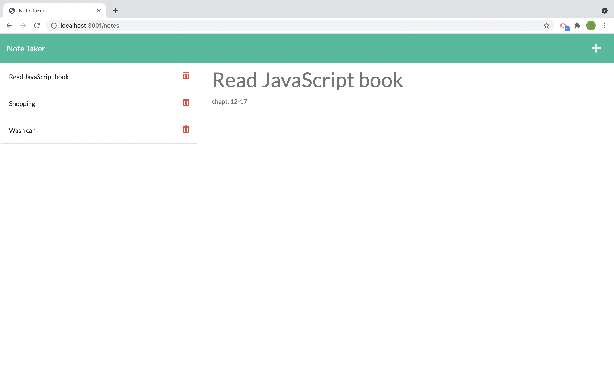

Note Taking App

This is a simple note-taking application that allows users to create, view, edit, and delete notes. Once the notes are saved, they are arranged to the roght side of the screen.

Features

This App provides a note taking tools for the user and saves them in the local database. User has the ability to inout title and description to their notes 
User can also do the following:

Create a new note with a title and content.

View a list of all existing notes.

Edit existing notes to update their title or content.

Delete notes that are no longer needed.

Technologies Used:

HTML5

CSS3

JavaScript

Local Storage

How to Use

You can visit the link below to access the application:
https://note-taker-xvsx.onrender.com

Another way to test the application is as floows:

Clone the repository to your local machine.

Run the srever file in your terminal 
visit: http://localhost:3001/

Start creating, viewing, editing, and deleting notes.

Demo:Here is the list of Screenshots showing the app functionality.

Screenshots

Screenshot 1

Homework/Note-Taker-/images/get-started.png

Screenshot 2

Also provided in the images folder is the video of app funtionality.

Author:

Rahul Sharma

Licenses: None 